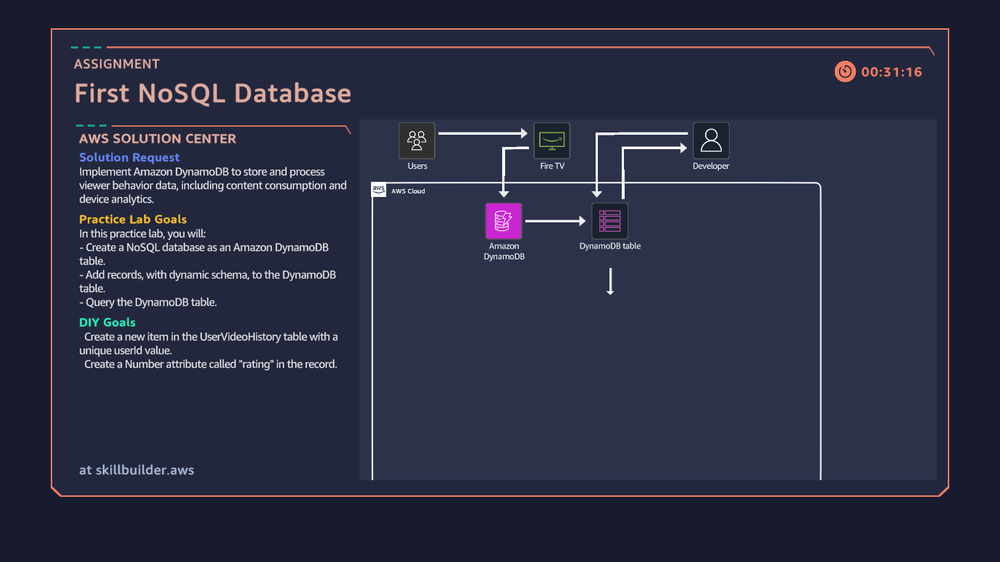
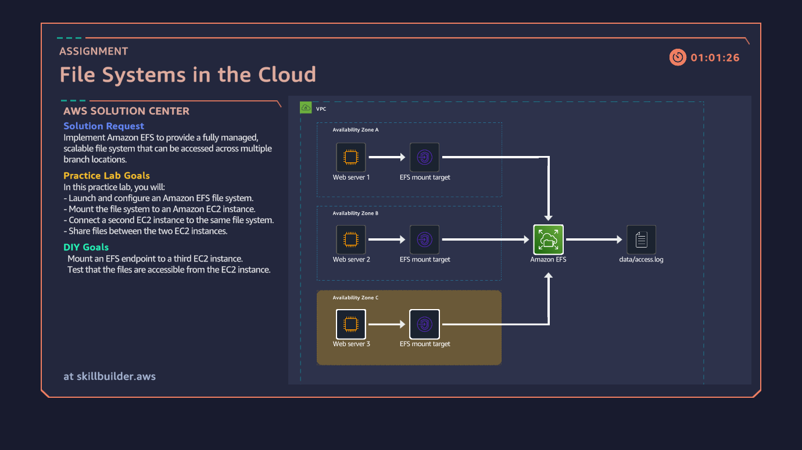
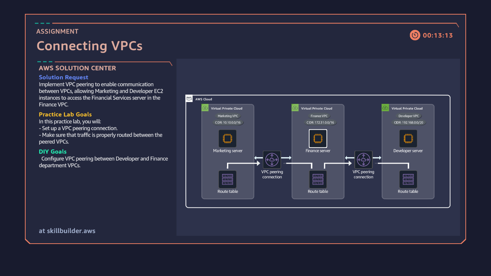
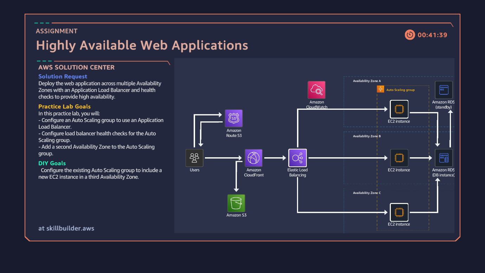
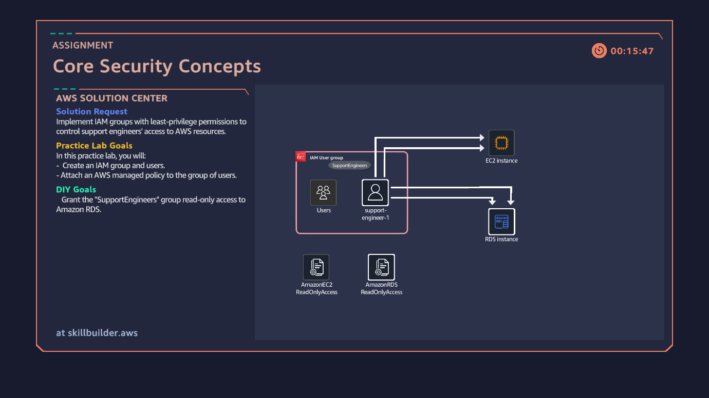

# ☁️ AWS Cloud Quest Learning Portfolio

This folder contains screenshots, diagrams, and concepts completed through **AWS Cloud Quest**, a gamified learning experience designed to teach cloud computing fundamentals and AWS services through hands-on challenges.

## 🎮 About AWS Cloud Quest

AWS Cloud Quest provides practical, scenario-based learning that helps learners develop cloud skills while solving real-world business and technical challenges.

## 📚 Completed Concepts

### 🗄️ First NoSQL Database

Learned the fundamentals of NoSQL databases and their use in scalable cloud applications.

---

### ⚡ Auto Heal & Scale

Explored auto-healing and auto-scaling mechanisms used to improve application reliability and performance.

---

### 📁 Cloud File System

Studied cloud storage solutions and distributed file systems used in modern cloud environments.

---

### 🌐 Connect VPC

Learned how Virtual Private Clouds (VPCs) enable secure networking and communication between cloud resources.

---

### 🚀 High Availability Web Application

Built an understanding of highly available architectures using redundancy, fault tolerance, and load balancing.

---

### 🔒 Security Concepts

Explored cloud security fundamentals including identity management, access controls, and data protection.

---

## 🎯 Skills Developed

- Cloud Computing Fundamentals
- AWS Core Services
- Cloud Networking
- Virtual Private Cloud (VPC)
- Scalability and Elasticity
- High Availability
- Cloud Storage Solutions
- Security Best Practices

## 📖 Learning Source

All concepts and activities in this folder were completed through **AWS Cloud Quest**, providing hands-on experience with cloud technologies and AWS services.

---

**Part of my Cloud Networking Journey and continuous cloud learning portfolio.** ☁️🚀
